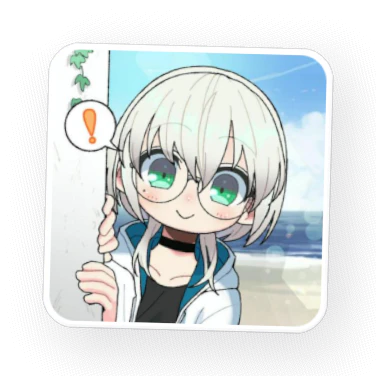
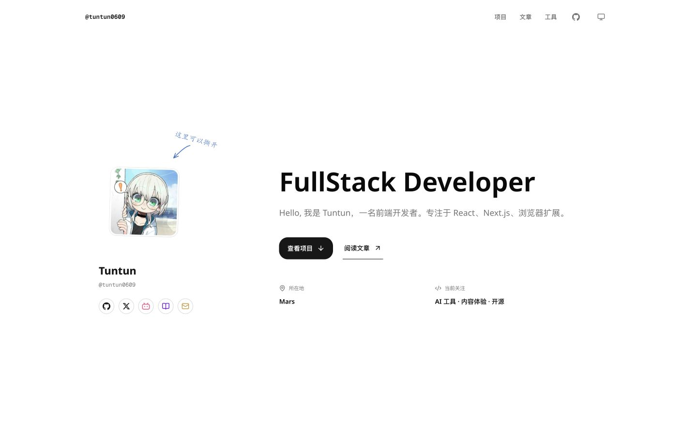

<p align="center">
  
</p>

<h1 align="center">Tuntun</h1>

<p align="center">Tuntun 的个人网站，放着我写的文章、做过的项目和一些浏览器工具。</p>

<p align="center">
  <a href="https://github.com/tuntun0609">GitHub</a>
  ·
  <a href="mailto:tun.nozomi@gmail.com">Email</a>
</p>



我想留一个长期更新的地方，放文章、项目和自己真正会用的工具。

## 这里有什么

### 个人主页

首页集中展示我的项目、最近文章和 GitHub 动态。我把头像做成可以从边缘撕起的贴纸，还做了一把 24 键的 3D 技术栈键盘；页面动效主要使用 Motion、Three.js 和 Paper Shaders 实现。

### 开发札记

一个用 MDX 编写的中文技术博客，记录前端工程、React、Next.js、浏览器扩展和 AI 工程等实践。内容由 Fumadocs 组织，支持标签筛选、文章目录、阅读进度和上下篇导航，也可以直接以 Markdown 阅读。

### 浏览器工具箱

这里放着视频转码、图片抠图与裁剪、文档校准、主题色提取、JSON 处理和文字 Diff 等工具。核心文件处理尽量直接在浏览器中完成；需要模型或额外运行时时，再按需从网络加载。

## 技术

Next.js（App Router） · React · TypeScript · Tailwind CSS · Fumadocs · Motion · Three.js · WebCodecs

## 本地运行

仓库使用 [Bun](https://bun.sh/) 管理依赖和脚本。

```bash
bun install --frozen-lockfile
bun run dev
```

打开 [http://localhost:3000](http://localhost:3000) 查看网站。

```bash
bun test
bun run check
```
